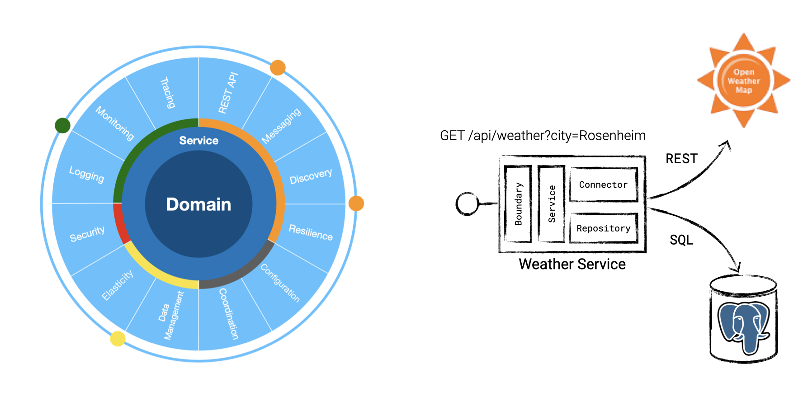

# Cloud-native Experience Lab (for Software Engineers)

This experience lab puts its focus on cloud-native software engineers. No matter which implementation language is used, the conceptual items are very similar.

Currently, several implementations of the lab and the weather service are available:

- DotNET: https://github.com/qaware/cloud-native-weather-dotnet
- JavaEE: https://github.com/qaware/cloud-native-weather-javaee
- NodeJS: https://github.com/qaware/cloud-native-weather-nodejs
- Spring: https://github.com/qaware/cloud-native-weather-spring
- Golang: https://github.com/qaware/cloud-native-weather-golang
